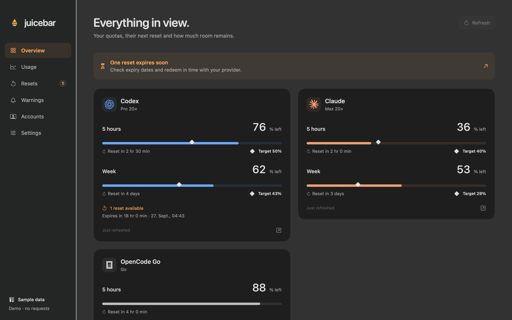

# Juicebar

[](https://github.com/Rasalas/juicebar/actions/workflows/build.yml)

A native macOS menu bar app for Codex, Claude and OpenCode usage. See your remaining quota, catch approaching limits and compare activity across your computers.

**Early preview · macOS 14+ · SwiftUI/AppKit · MIT license**

Juicebar is open source. Direct downloads and updates are free. Mac App Store distribution is on hold while equivalent, provider-compliant integrations remain unresolved. There is no paid feature gate, required donation or Juicebar account. Windows and Linux are possible future ports, not supported platforms today.

## What it does

- A colored menu bar line for each limit, in a stable provider order. Choose which limits appear. Click for remaining quota, reset times and the expected balance for steady usage.
- Warnings at a configurable usage threshold, ahead of steady consumption, or when your current pace is likely to exhaust a limit soon. Optional sound, quiet hours and expiry reminders for banked resets.
- Combined local Codex, Claude and OpenCode history, daily charts and an activity calendar. Imports run at startup and every five minutes after completion; cached results survive restarts.
- Optional SSH sources using existing host aliases. The remote collector returns usage metadata, not conversations.
- A theoretical API-cost equivalent based on model-specific token types and published standard prices. Confirmed alpha-model aliases are resolved retrospectively. Unknown models stay unpriced.
- Multiple accounts, provider error isolation, request timeouts and backoff. No analytics or advertising.

The interface supports English and German, follows the system language and offers an override in Settings. Confirmed names and API prices update through a signed data catalog.

[Website](https://rasalas.github.io/juicebar/) · [Setup & help](https://rasalas.github.io/juicebar/help.html)



## Install or build

Download the [latest macOS preview](https://github.com/Rasalas/juicebar/releases/latest). The official DMG is for Apple Silicon, signed with Developer ID and notarized by Apple. Open it, drag Juicebar.app to Applications, eject the disk image and launch Juicebar from Applications. App updates are delivered through Sparkle and remain free.

The first release was verified on the development Mac, including an installed old-to-new update. Broader hardware and macOS-version testing is still needed. CI artifacts are development builds, not official downloads.

To build from source, install Xcode with Swift 6 on macOS 14 or newer:

```sh
git clone https://github.com/Rasalas/juicebar.git
cd juicebar
swift test
bash scripts/build-app.sh
mkdir -p "$HOME/Applications"
ditto dist/Juicebar.app "$HOME/Applications/Juicebar.app"
(cd "$HOME" && open "$HOME/Applications/Juicebar.app")
```

Quit an existing Juicebar instance before replacing it. A source build uses an ad-hoc signature and does not replace itself through the official updater. Rebuild from a newer source tag to update. Install locally before launching; starting the build bundle on an external drive may trigger a macOS removable-media prompt.

```sh
# Synthetic data, without provider requests or persistent settings
open -n "$HOME/Applications/Juicebar.app" --args --demo
# Read-only diagnostics; use the locally installed app
(cd "$HOME" && "$HOME/Applications/Juicebar.app/Contents/MacOS/Juicebar" --diagnose)
```

Enable notifications explicitly in **Warnings → Enable**, or **Warnungen → Aktivieren**. macOS Focus and display-sharing settings can suppress banners and sounds even if a notification appears in Notification Center.

## Refresh screenshots

On macOS with Swift 6 and Python 3.9 or later:

```sh
python3 scripts/update-screenshots.py
# Also update the German portfolio page in its sibling checkout:
python3 scripts/update-screenshots.py --portfolio ../tbuck-www
```

This builds the current app and renders its real views offscreen with synthetic data in English and German. It refreshes the website images, screenshot drafts and HTML image dimensions. No desktop capture, provider login or changes to your accounts are involved. The command does not commit or publish; review the resulting images first.

## Connections

| Provider | Data | Prerequisite or limitation |
| --- | --- | --- |
| ChatGPT / Codex | Reported quota windows and banked reset expiry | Logged-in Codex CLI; app-server integration tested with 0.157.0 |
| Claude subscription | Short, weekly and additional model limits; plan tier | Logged-in Claude Code CLI; experimental usage interface tested with 2.1.241 |
| Claude reset offers | Manual expiry reminders | Automatic reset inventory is not available; no subscription-token extraction or private reset endpoint |
| OpenCode Go | Short, weekly and monthly quota | Active Go subscription and local OpenCode Go API key, or a key entered in Juicebar |
| OpenCode Zen | Local activity and estimated API equivalent | No verified balance endpoint |
| OpenRouter | Balance and total spending | Management key; not live-verified yet |
| OpenAI / Anthropic API | Organization costs for the current UTC month and a user-set budget | Appropriate admin key, not an ordinary model key; not live-verified yet |

Juicebar does not send model prompts to measure quota. Local token counts are not converted into subscription percentages. Additional limits in supported response structures appear dynamically; new authentication methods or incompatible schemas need adapter changes. Private or experimental provider interfaces can change without notice.

## History and estimates

Imports cover the most recent 90 days. Missing or deleted source logs cannot always be reconstructed. Claude's statistics cache can fill completely missing days, but those aggregates include user/tool messages and cannot always be priced. OpenCode SQLite is opened read-only with bounded queries. Cached metadata and deduplication reduce repeated work and retain already-imported data when a source is temporarily unavailable.

API equivalents use the current catalog of standard prices, not historical invoices. Coverage is displayed, and unpriced usage is not presented as zero cost. Cache and reasoning semantics differ by provider. See [activity and costs](docs/activity-and-costs.md) and [history/SSH](docs/activity-history.md).

## Privacy and operation

Usage metadata and settings stay under `~/Library/Application Support/Juicebar`. Keys entered in the app go to macOS Keychain. Provider integrations may read existing CLI credentials and contact the selected providers. No conversation contents are retained by Juicebar. [Privacy details](PRIVACY.md).

Warnings need the app to be running. Juicebar does not wake a sleeping Mac. Predictions require enough fresh measurements in the same limit window; missing or stale data remains identifiable.

## Contribute and support

[Contributing](CONTRIBUTING.md) covers provider adapters and synthetic tests. [Security reports](SECURITY.md) should be private. The core models and rules are separated from the UI, but the core package still contains macOS-specific transport and Keychain code.

- [GitHub Sponsors](https://github.com/sponsors/Rasalas) for ongoing support.
- [One-time contribution](https://buymeacoffee.com/tbuck91j).
- A future store purchase will support development while all direct-version updates remain available without payment.

[Distribution plan](docs/distribution.md) · [Release procedure](docs/releasing.md) · [Validation](docs/validation.md) · [Provider contracts](docs/integration-contracts.md) · [Technology choice](docs/technology-choice.md)

Juicebar is an independent project, not an official product of the connected providers. See [LICENSE](LICENSE) and [third-party notices](THIRD_PARTY_NOTICES.md).
